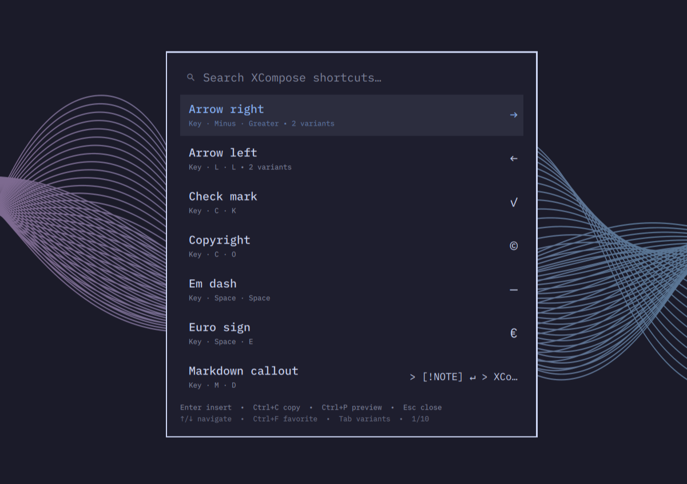

# XCompose Picker for Omarchy

Search, inspect, and insert shortcuts from your personal XCompose file without leaving Omarchy Shell.

The picker reads `$XCOMPOSEFILE` when set, otherwise `~/.XCompose`. It indexes direct rules only, so system compose tables referenced with `include` never overwhelm personal shortcuts.

## Preview



## Demo


## Features

- Search descriptions, output, key names, compact sequences such as `rr`, and Compose tokens such as `<space> <e>`
- Group all shortcuts that produce the same output
- Cycle variations with `Tab` and `Shift+Tab`
- Live reload while the picker is open
- Local, opaque usage history with no telemetry
- Favorites, stored locally as opaque entry IDs
- Safe clipboard-and-paste insertion using `wl-copy` and `wtype`
- Configurable, reversible `SUPER + Q` keybind helper

## Requirements

- Omarchy Quattro with shell plugin support
- `wl-clipboard`, `wtype`, and Node.js (for bounded local-file reads)
- `~/.XCompose`, or an `XCOMPOSEFILE` environment variable

## Install

Review third-party plugin code before enabling it: Omarchy plugins run inside the long-running, unsandboxed shell process.

```bash
omarchy plugin add https://github.com/marlonangeli/omarchy-xcompose.git --enable
```

Open it directly before configuring a keybind:

```bash
omarchy-shell shell summon dev.ilegna.xcompose '{}'
```

## Usage

| Key | Action |
| --- | --- |
| Type | Search descriptions, output, or sequences |
| Up / Down | Move selection |
| Home / End | First / last result |
| Page Up / Page Down | Move by one page |
| Tab / Shift+Tab | Cycle shortcuts for the selected output |
| Enter | Insert the selected result |
| Ctrl+C | Copy the selected result without inserting |
| Ctrl+F | Toggle the selected shortcut as a favorite |
| Ctrl+P | Toggle the full result preview |
| Escape | Clear search, then close |

Long or multiline values are inserted in full. The results list keeps a compact,
single-line preview so one entry cannot cover another; press `Ctrl+P` to inspect
the selected value in a wrapped, scrollable full preview before inserting it.

Favorites rank above history when the search is empty; exact and fuzzy search relevance still takes priority while filtering.

Compose tokens can be typed literally. For example, `<space> <e>` finds a rule
whose sequence contains `Space` followed by `E`; add ordinary words such as
`euro` to require both the tokens and the normal fuzzy search match.

A leading literal space is also a `Space` token: type space then `n` to find
`<space> <n>`. The search field renders literal spaces as `▁` for visibility,
while preserving the actual characters for matching; use explicit tokens such
as `<space> <space>` when searching for repeated spaces.

Common leading punctuation also searches its Compose key: `.`, `,`, `:`, `;`,
`<`, `>`, `/`, `\`, `[`, `]`, brackets, quotes, and standard symbol keys.
For example, typing `/` finds rules containing `<slash>`.

Matching text is bold and underlined directly in the description, output, and
Compose sequence, so it is clear why each result was returned.

## XCompose descriptions

Comments immediately before a rule become its description. An inline comment overrides that inherited description for one rule.

```text
# Arrow right
<Multi_key> <r> <r> : "→"
<Multi_key> <minus> <greater> : "→"

<Multi_key> <c> <o> : "©" # Copyright
```

See [XCompose format](docs/xcompose.md) for supported syntax and diagnostics.

## Configure a keybind

The default is `SUPER + Q`.

```bash
~/.config/omarchy/plugins/dev.ilegna.xcompose/scripts/keybind install
```

Choose another binding explicitly:

```bash
~/.config/omarchy/plugins/dev.ilegna.xcompose/scripts/keybind install --binding "SUPER + CTRL + X"
```

The helper creates a timestamped backup, validates Hyprland, and restores the
previous file if validation fails. Re-running `install` replaces only the
plugin-managed block. Use `--replace` only after checking the current keybinding;
it adds the required `hl.unbind()` override.

See [Configuration](docs/configuration.md) for source selection, state files,
custom launch payloads, and keybinding management.

## Diagnose and remove

```bash
~/.config/omarchy/plugins/dev.ilegna.xcompose/scripts/doctor
~/.config/omarchy/plugins/dev.ilegna.xcompose/scripts/keybind uninstall
~/.config/omarchy/plugins/dev.ilegna.xcompose/scripts/uninstall
```

The uninstall wrapper removes only its marked keybind block before removing the plugin. Manually created bindings are untouched.

`doctor` checks required commands, plugin discovery, the managed keybinding,
and duplicate or conflicting XCompose sequences. See
[Troubleshooting](docs/troubleshooting.md) when a check fails.

## Security and development

The plugin reads one local XCompose file, invokes `wl-copy` and `wtype`, stores only opaque usage identifiers locally, and makes no network requests or telemetry calls. See [SECURITY.md](SECURITY.md).

For architecture, XCompose behavior, and local validation, see
[Architecture](docs/architecture.md) and [XCompose format](docs/xcompose.md).
